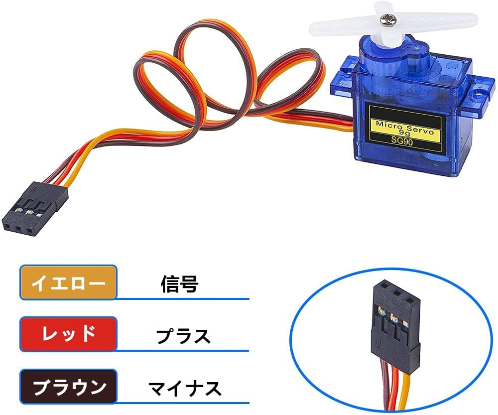
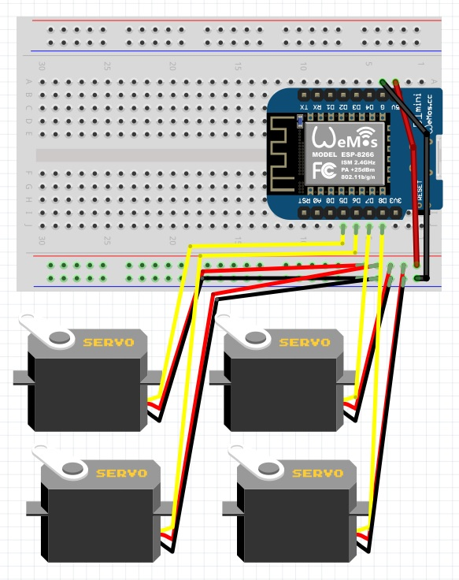
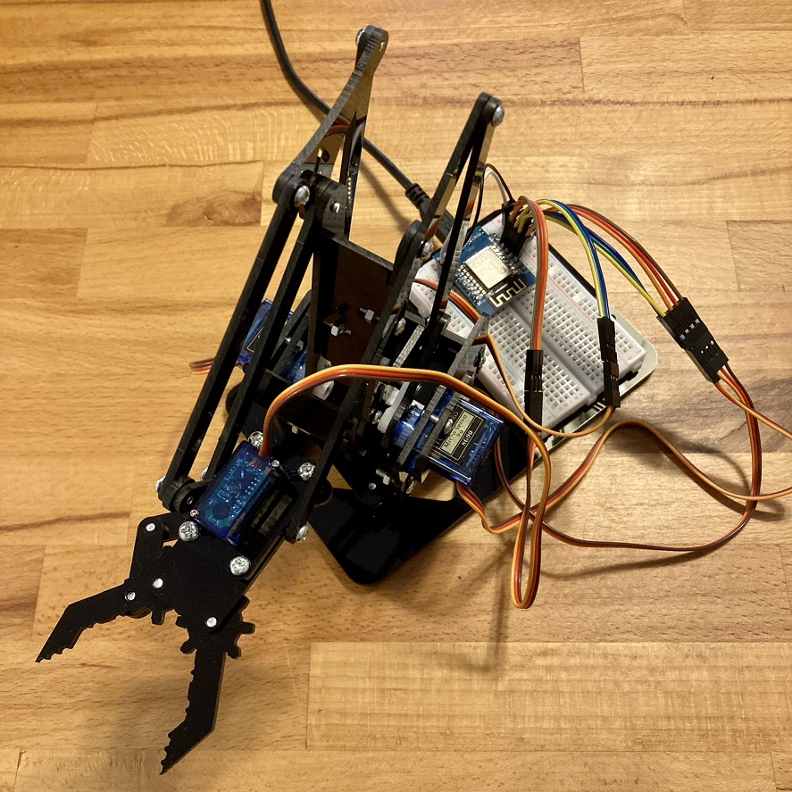
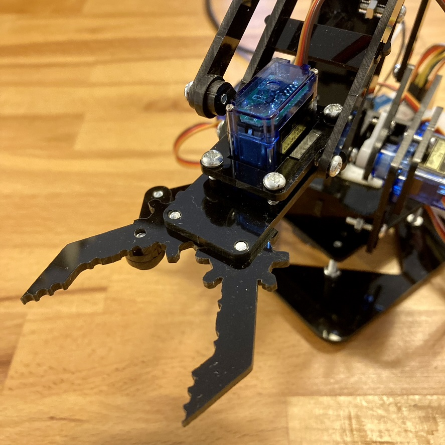
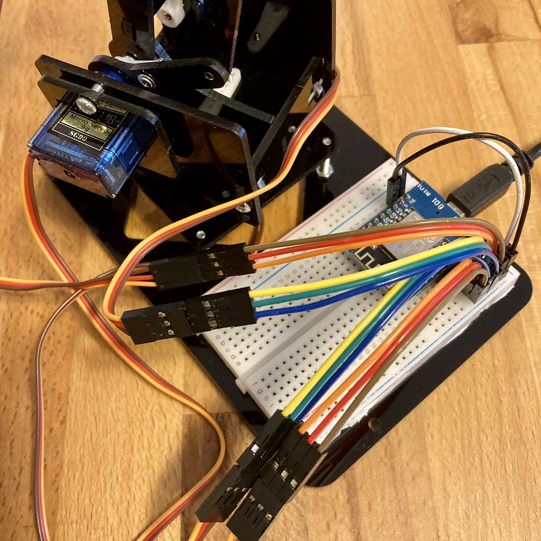

<!-- ABOUT THE PROJECT -->

# 1. プロジェクトについて

WiFi が使用できるマイコンボード WeMos D1 Mini と、マイクロサーボ SG-90 を使ったロボットアームの Arduino IDE のスケッチです。

D1 Mini を WiFi アクセスポイント として、スマホからアクセスし、表示されたページからロボットアームを操作します。 
操作を受けた D1 Mini はマイクロサーボへ PWM 信号を送信することで、マイクロサーボの回転角度を自由自在に変更します。 
Arduino IDE からスケッチをマイコンボードに書き込みし、ホームページのファイルをマイコンボードをコピーすることで、スマホから操作できるロボットアームを作ることができます。

操作はスマホでなくても、他のボタンやコントローラーを接続して使ってもよいので、工夫次第で色々な拡張ができます。

(<a href="#readme-top">back to top</a>)

<!-- ABOUT THE TARGET -->

# 2. SG-90 仕様

- 動作電圧：4.8V(~5V)
- 外形寸法：22.2x11.8x31mm
- 重量：9g

(<a href="#readme-top">back to top</a>)

<!-- GETTING STARTED -->

# 3. さあ、はじめよう！

本プロジェクトのスケッチを使用するには、事前に Arduino IDE 開発環境と ESP8266 が動作するための設定が必要です。

## 3.1. ロボットアームの組み立て方

中国語の動画ですが、丁寧に順序立てて解説していますので、1 日 2 日で組み立てできます。

- [ロボットアームの組み立て方](https://v.youku.com/v_show/id_XNDA5MzExMzQ1Ng==.html)

(<a href="#readme-top">back to top</a>)

<!-- USAGE EXAMPLES -->

# 4. 使い方

## 4.1. ファイルアップロード

タンクをコントロールするためのホームページ「index.html」を D1 Mini へアップロードするには LittleFS を使用します。

- [Arduino ESP8266 LittleFS Filesystem Uploader](https://github.com/earlephilhower/arduino-esp8266littlefs-plugin)

Arduino IDE 2.0 以降は使用できないようですので、Arduino IDE 1.8 をご使用ください。

(<a href="#readme-top">back to top</a>)

## 4.2. 配線図

(<a href="#readme-top">back to top</a>)

<!-- LICENSE -->

# 5. ライセンス

特になし

(<a href="#readme-top">back to top</a>)

<!-- ACKNOWLEDGMENTS -->

# 6. 参考

- [Arduino を使ってサーボモーターを制御してみよう。](https://miraluna.hatenablog.com/entry/penguin)
- [Arduino でマイクロサーボモータ SG90 の使い方](https://101010.fun/iot/arduino-servo.html)

Google や Youtube で以下検索ください。色々情報入手できると思います！

- 「ロボットアーム SG90」
- 「WeMos D1 Mini SG90」

## 6.1. ロボットアーム

(<a href="#readme-top">back to top</a>)

