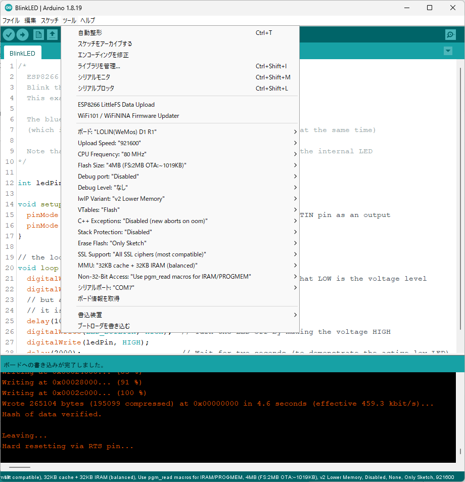
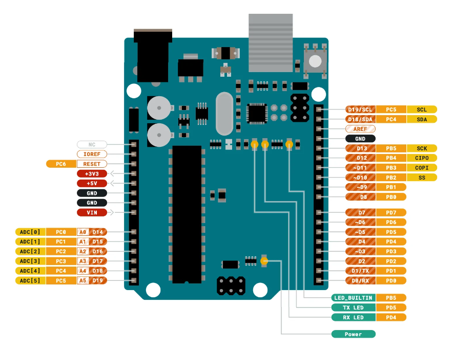

<!-- ABOUT THE PROJECT -->

# 1. プロジェクトについて

WiFi が使用できるマイコンボード WeMos D1 の LED を使った Arduino IDE のスケッチです。  
LED のプラスを D4、マイナスを GND に接続すると点滅します。抵抗は適宜付けてください。

# 2. ボード設定

# 3. ピン配置

(<a href="#readme-top">back to top</a>)

