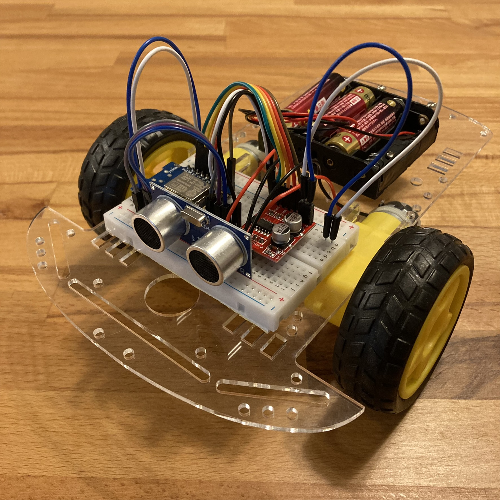
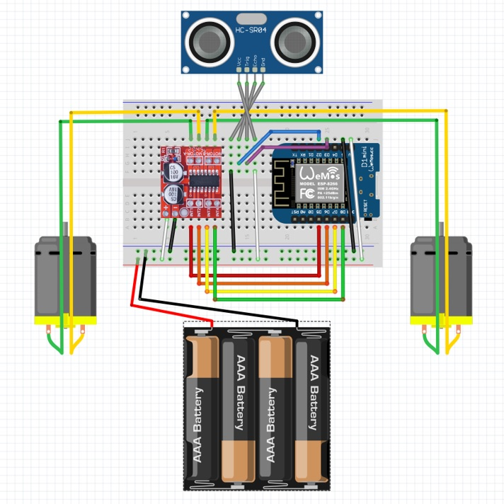

<!-- ABOUT THE PROJECT -->

# 1. プロジェクトについて

WiFi が使用できるマイコンボード WeMos D1 Mini と、モータードライバー Mini L298 を使ったロボットカーの Arduino IDE のスケッチです。

D1 Mini を WiFi アクセスポイント として、スマホからアクセスし、表示されたページからロボットカーを操作します。
操作を受けた D1 Mini はモータードライバーを介してモーターを制御し、タイヤを自由自在に回転させます。
Arduino IDE からスケッチをマイコンボードに書き込みし、ホームページのファイルをマイコンボードをコピーすることで、スマホから操作のできるロボットカーを作ることができます。

また本プロジェクトでは、超音波距離センサー HC-SR04 を用いた距離の測定を行うことができます。Auto ボタンを押すと自動操縦となり、前方との距離が 25cm 未満になると自動でぶつからないように回避行動をとります。

制御するモーターはなんでも良いので、様々な環境で使用することができます。

(<a href="#readme-top">back to top</a>)

<!-- ABOUT THE TARGET -->

# 2. HC-SR04 仕様

- 測距範囲：2~400cm
- 電源電圧：DC 5.0V
- 動作電流：15mA
- 動作周波数：40kHz
- トリガ信号：10μS(TTL レベルのパルス波)
- エコー出力信号：反射(往復)時間
- サイズ：45×20×15mm

※通電時は GND 端子が最初に接続されるようにしてください。

(<a href="#readme-top">back to top</a>)

<!-- GETTING STARTED -->

# 3. さあ、はじめよう！

本プロジェクトのスケッチを使用するには、事前に Arduino IDE 開発環境と ESP8266 が動作するための設定が必要です。

(<a href="#readme-top">back to top</a>)

<!-- USAGE EXAMPLES -->

# 4. 使い方

## 4.1. 組み立て

タンクを作成する場合にはユニバーサルプレートを次のように切って写真参考に組み立ててください。

ロボットカーは以下の通り。

## 4.2. 配線図

## 4.3. ファイルアップロード

ロボットカーをコントロールするためのホームページ「index.html」を D1 Mini へアップロードするには LittleFS を使用します。

- [Arduino ESP8266 LittleFS Filesystem Uploader](https://github.com/earlephilhower/arduino-esp8266littlefs-plugin)

Arduino IDE 2.0 以降は使用できないようですので、Arduino IDE 1.8 をご使用ください。

(<a href="#readme-top">back to top</a>)

<!-- LICENSE -->

# 5. ライセンス

(<a href="#readme-top">back to top</a>)

<!-- ACKNOWLEDGMENTS -->

# 6. 参考

- [Arduino で DC モーターを制御する](https://burariweb.info/electronic-work/arduino-learning/arduino-motor-driver-l298n.html)
- [Arduino と Mini L298N モータードライバーでモーターを制御する](https://web-memo-s.hatenablog.com/entry/2021/02/22/125619)
- [RaspberryPi Pico で DC モータとモータドライバを使う](https://tamanegi.digick.jp/computer-embedded/module/dcmotor/)
- [Create a WIFI-controlled Robot with Wemos D1 Mini + L298N](https://www.youtube.com/watch?v=BuSS_MBPCEk)
- [ESP8266-Wemos D1 mini with HC-SR04 Ultrasonic Sensor](https://microdigisoft.com/esp8266-wemos-d1-mini-with-hc-sr04-ultrasonic-sensor/)

Google や Youtube で「D1 Mini L298N」「D1 Mini HC-SR04」を検索すると色々情報入手できます。

(<a href="#readme-top">back to top</a>)

