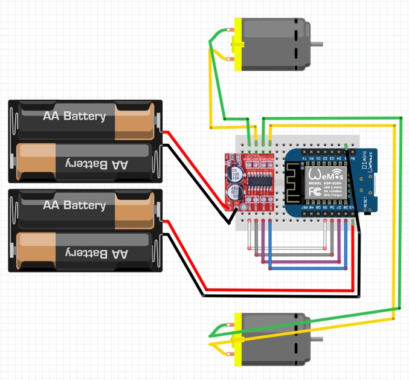
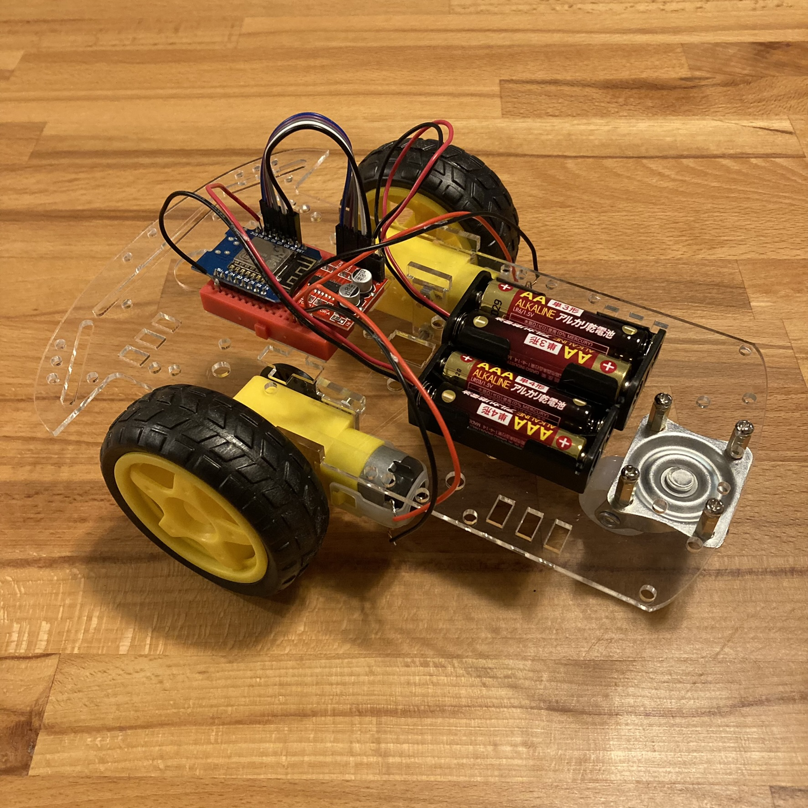

<!-- ABOUT THE PROJECT -->

# 1. プロジェクトについて

WiFi が使用できるマイコンボード WeMos D1 Mini と、モータードライバー Mini L298 を使ったラジコンの Arduino IDE のスケッチです。

D1 Mini を WiFi アクセスポイント として、スマホからアクセスし、表示されたページからラジコンを操作します。
操作を受けた D1 Mini はモータードライバーを介してモーターを制御し、タイヤを自由自在に回転させます。
Arduino IDE からスケッチをマイコンボードに書き込みし、ホームページのファイルをマイコンボードをコピーすることで、スマホから操作のできるラジコンを作ることができます。

制御するモーターはなんでも良いので、様々な環境で使用することができます。

(<a href="#readme-top">back to top</a>)

<!-- ABOUT THE TARGET -->

# 2. Mini L298 仕様

- 更新中・・・

(<a href="#readme-top">back to top</a>)

<!-- GETTING STARTED -->

# 3. さあ、はじめよう！

本プロジェクトのスケッチを使用するには、事前に Arduino IDE 開発環境と ESP8266 が動作するための設定が必要です。

## 3.1. 更新中・・・

(<a href="#readme-top">back to top</a>)

<!-- USAGE EXAMPLES -->

# 4. 使い方

更新中・・・

## 4.1. 配線図

(<a href="#readme-top">back to top</a>)

<!-- LICENSE -->

# 5. ライセンス

(<a href="#readme-top">back to top</a>)

<!-- ACKNOWLEDGMENTS -->

# 6. 参考

- [Arduino で DC モーターを制御する](https://burariweb.info/electronic-work/arduino-learning/arduino-motor-driver-l298n.html)
- [Arduino と Mini L298N モータードライバーでモーターを制御する](https://web-memo-s.hatenablog.com/entry/2021/02/22/125619)
- [Create a WIFI-controlled Robot with Wemos D1 Mini + L298N](https://www.youtube.com/watch?v=BuSS_MBPCEk)

Google や Youtube で「D1 Mini L298N」を検索すると色々情報入手できます。

## 6.1. ロボットカー

(<a href="#readme-top">back to top</a>)

